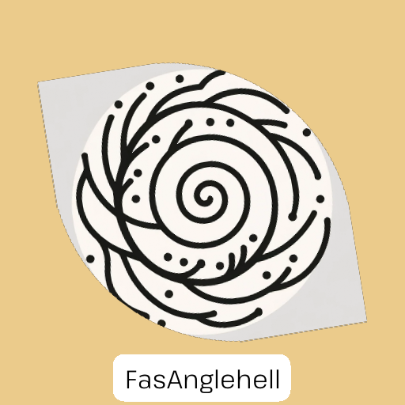

# Tower of Tech

This repository contains tech-related playlists and utilities used to manage them.

## Playlists

The final (planned, can be changed) state of playlist served by this repository should be like this:
A playlist name should contain prefix and "tech" suffix.
  

- Speed prefix could be "Adep", "Acc", "Mid", "Fast" and "Sonic".
- Tech suffix would be "Comfy", "Tech", "Hitech", "Anglehell" and "Tempo".

There are and will be "guest" playlists - f.e. Morgolf's.

### Installation and current state

GitHub doesn't like the OneClick url, go to Details or [to this list](https://towerofte.ch/home/browse) if you like this way more

If you need help with installing playlists, you can head to [installation guide](https://towerofte.ch/home/playlist-install-guide/)

Zip containing all playlists can be found [here](https://github.com/Danielduel/tower-of-tech/releases/download/0.0.20/ToT.zip)

|                                                                              | Name                | Pacing    | Complexity | Items |                                                                                                                                                                      |
| ---------------------------------------------------------------------------- | ------------------- | --------- | ---------- | ----- | -------------------------------------------------------------------------------------------------------------------------------------------------------------------- |
|      | ToT - AdepComfy     | Slower    | Easy       | 110   | [Details](https://towerofte.ch/home/playlist/01HK8XCHRH8RDXEEP9F4211NVG/details) [Raw](https://towerofte.ch/api/v1/playlist/get/01HK8XCHRH8RDXEEP9F4211NVG/download) |
|       | ToT - AdepTech      | Slower    | Normal     | 124   | [Details](https://towerofte.ch/home/playlist/01HK8XCHRJMANCHBSA0CVA354H/details) [Raw](https://towerofte.ch/api/v1/playlist/get/01HK8XCHRJMANCHBSA0CVA354H/download) |
|     | ToT - AdepHitech    | Slower    | Hard       | 69    | [Details](https://towerofte.ch/home/playlist/01HK8XCHRNPHBZSJMKFWBPKD32/details) [Raw](https://towerofte.ch/api/v1/playlist/get/01HK8XCHRNPHBZSJMKFWBPKD32/download) |
|  | ToT - AdepAnglehell | Slower    | Expert     | 20    | [Details](https://towerofte.ch/home/playlist/01HM4203RYZX1QKGFSX53GTJ1A/details) [Raw](https://towerofte.ch/api/v1/playlist/get/01HM4203RYZX1QKGFSX53GTJ1A/download) |
|      | ToT - AdepTempo     | Slower    | Insane     | 15    | [Details](https://towerofte.ch/home/playlist/01HM4203S9ZDF4C4SR1CF25JPN/details) [Raw](https://towerofte.ch/api/v1/playlist/get/01HM4203S9ZDF4C4SR1CF25JPN/download) |
|       | ToT - AccComfy      | Average   | Easy       | 122   | [Details](https://towerofte.ch/home/playlist/01HK8XCHR9VPKXQ898F7TPWVFM/details) [Raw](https://towerofte.ch/api/v1/playlist/get/01HK8XCHR9VPKXQ898F7TPWVFM/download) |
|        | ToT - AccTech       | Average   | Normal     | 225   | [Details](https://towerofte.ch/home/playlist/01HK8XCHQ6KFWB4MRA796Q0245/details) [Raw](https://towerofte.ch/api/v1/playlist/get/01HK8XCHQ6KFWB4MRA796Q0245/download) |
|      | ToT - AccHitech     | Average   | Hard       | 176   | [Details](https://towerofte.ch/home/playlist/01HK8XCHRDHER45YMZ7XDS0RZ6/details) [Raw](https://towerofte.ch/api/v1/playlist/get/01HK8XCHRDHER45YMZ7XDS0RZ6/download) |
|   | ToT - AccAnglehell  | Average   | Expert     | 112   | [Details](https://towerofte.ch/home/playlist/01HK8XCHQCFJCC8B6BJNY2F0A1/details) [Raw](https://towerofte.ch/api/v1/playlist/get/01HK8XCHQCFJCC8B6BJNY2F0A1/download) |
|       | ToT - AccTempo      | Average   | Insane     | 22    | [Details](https://towerofte.ch/home/playlist/01HK8XCHRRG9MJ0QM2FT5ZP6SP/details) [Raw](https://towerofte.ch/api/v1/playlist/get/01HK8XCHRRG9MJ0QM2FT5ZP6SP/download) |
|       | ToT - MidComfy      | Faster    | Easy       | 68    | [Details](https://towerofte.ch/home/playlist/01HM4203SPHDAP94MS02S49JC6/details) [Raw](https://towerofte.ch/api/v1/playlist/get/01HM4203SPHDAP94MS02S49JC6/download) |
|        | ToT - MidTech       | Faster    | Normal     | 159   | [Details](https://towerofte.ch/home/playlist/01HK8XCHRK0NSY3PNTPPBJ0X1F/details) [Raw](https://towerofte.ch/api/v1/playlist/get/01HK8XCHRK0NSY3PNTPPBJ0X1F/download) |
|      | ToT - MidHitech     | Faster    | Hard       | 127   | [Details](https://towerofte.ch/home/playlist/01HK8XCHPPDM9XD77EGJCVTA81/details) [Raw](https://towerofte.ch/api/v1/playlist/get/01HK8XCHPPDM9XD77EGJCVTA81/download) |
|   | ToT - MidAnglehell  | Faster    | Expert     | 53    | [Details](https://towerofte.ch/home/playlist/01HM4203SHXNGDMWZVY685MDVR/details) [Raw](https://towerofte.ch/api/v1/playlist/get/01HM4203SHXNGDMWZVY685MDVR/download) |
|       | ToT - MidTempo      | Faster    | Insane     | 5     | [Details](https://towerofte.ch/home/playlist/01HM7KRRZ7H0XFCNX8D9WY5ATP/details) [Raw](https://towerofte.ch/api/v1/playlist/get/01HM7KRRZ7H0XFCNX8D9WY5ATP/download) |
|       | ToT - FasComfy      | Very fast | Easy       | 18    | [Details](https://towerofte.ch/home/playlist/01HM4203RT18K3SZ4VEJ79E12G/details) [Raw](https://towerofte.ch/api/v1/playlist/get/01HM4203RT18K3SZ4VEJ79E12G/download) |
|        | ToT - FasTech       | Very fast | Normal     | 40    | [Details](https://towerofte.ch/home/playlist/01HM4203RR9TZ2KAYG3BQ4ZJRV/details) [Raw](https://towerofte.ch/api/v1/playlist/get/01HM4203RR9TZ2KAYG3BQ4ZJRV/download) |
|      | ToT - FasHitech     | Very fast | Hard       | 24    | [Details](https://towerofte.ch/home/playlist/01HM4203S214YAVEJ6NWWE3KF0/details) [Raw](https://towerofte.ch/api/v1/playlist/get/01HM4203S214YAVEJ6NWWE3KF0/download) |
|   | ToT - FasAnglehell  | Very fast | Expert     | 10    | [Details](https://towerofte.ch/home/playlist/01HM4203SQNWEVXQ5KPVXY8QHJ/details) [Raw](https://towerofte.ch/api/v1/playlist/get/01HM4203SQNWEVXQ5KPVXY8QHJ/download) |
|       | ToT - FasTempo      | Very fast | Insane     | 1     | [Details](https://towerofte.ch/home/playlist/01HS9TYNFZB2XES1K56E8FT6CR/details) [Raw](https://towerofte.ch/api/v1/playlist/get/01HS9TYNFZB2XES1K56E8FT6CR/download) |
|     | ToT - SonicComfy    | Insane    | Easy       | 2     | [Details](https://towerofte.ch/home/playlist/01HM7KRS01RR2YY4PSBN4F7VE5/details) [Raw](https://towerofte.ch/api/v1/playlist/get/01HM7KRS01RR2YY4PSBN4F7VE5/download) |
|      | ToT - SonicTech     | Insane    | Normal     | 8     | [Details](https://towerofte.ch/home/playlist/01HM4203SGVE0M1ZBPQ89F42K7/details) [Raw](https://towerofte.ch/api/v1/playlist/get/01HM4203SGVE0M1ZBPQ89F42K7/download) |
|    | ToT - SonicHitech   | Insane    | Hard       | 3     | [Details](https://towerofte.ch/home/playlist/01HM7KRRZGV8Q5F7FXDK9FDGYG/details) [Raw](https://towerofte.ch/api/v1/playlist/get/01HM7KRRZGV8Q5F7FXDK9FDGYG/download) |

## Contributing

Do you have a great...

- ...tech playlist and you would love to share it?
- ...idea regarding this project?
- ...advice to move some map to other category?
- ...opinion on something is not actually a tech?

If first 3: DM me on discord or do an issue on this repository

What I need now?

- More people recommending me maps to try out for categorization
- More people who will be doublechecking categorization

## Thanks!

People who like to discuss tech

- Cush (https://www.twitch.tv/cush_is_me)
- Chrisvenator (https://www.twitch.tv/chrisvenator)
- winter (https://www.twitch.tv/winteredge)
- Goose (https://www.twitch.tv/goosychan)
- DarkyFox (https://www.twitch.tv/darkyfox__)
- i_time (https://www.twitch.tv/i_time)

People who allowed me to add their playlists to the project

- Morgolf (https://www.twitch.tv/morgolf)
- Exa (https://www.twitch.tv/exa_cute)
- HitMeWMusic (https://www.twitch.tv/hitmewmusic)
- Mochichi (https://www.twitch.tv/mochichi72)
- Motzel
- NamakiMono (https://www.twitch.tv/namaki_mono)
- Pleo
- TheHarshJellyfish (https://www.twitch.tv/theharshjellyfish)

## ToT Bot

Invite link

https://discord.com/api/oauth2/authorize?client_id=1171582001900421192&permissions=17600776047616&scope=bot+applications.commands

